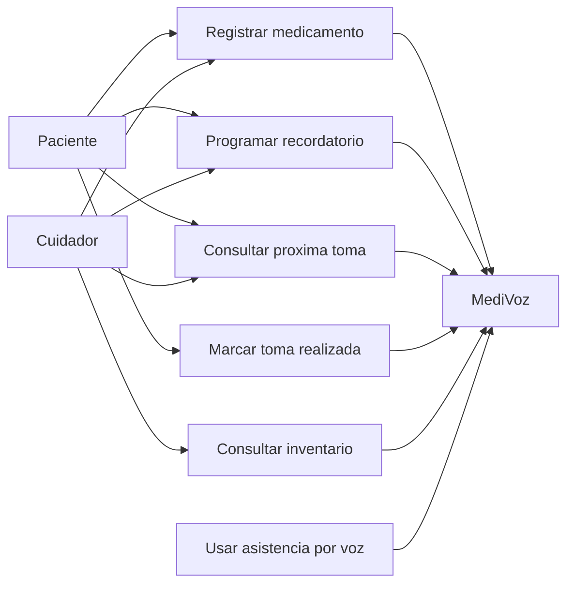
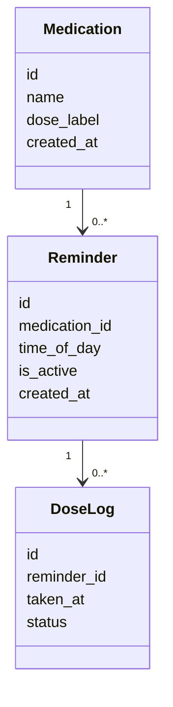
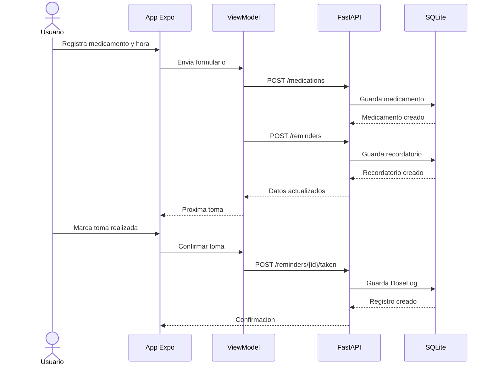
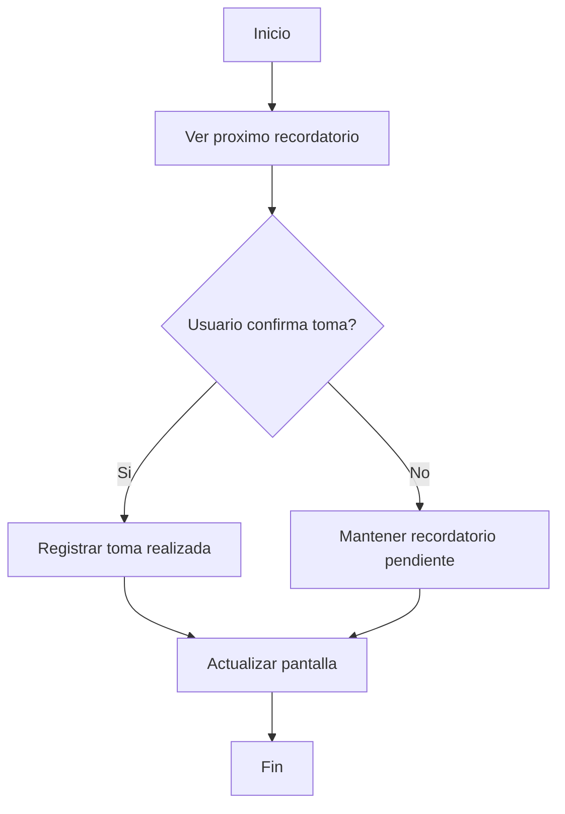
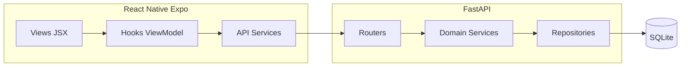

# Documentacion UML y Requisitos Implementation Plan

> **For agentic workers:** REQUIRED SUB-SKILL: Use superpowers:subagent-driven-development (recommended) or superpowers:executing-plans to implement this plan task-by-task. Steps use checkbox (`- [ ]`) syntax for tracking.

**Goal:** Crear una base documental versionable para requisitos, historias de usuario, arquitectura y diagramas UML de MediVoz.

**Architecture:** La fuente principal sera Markdown dentro de `docs/`, navegable desde Obsidian y editable por agentes. Los diagramas UML se escribiran en Mermaid dentro de Markdown; Excalidraw quedara como espacio complementario para bocetos visuales.

**Tech Stack:** Markdown, Mermaid, Obsidian, Excalidraw, Git, ClickUp como trazabilidad externa.

---

## File Structure

- Create: `docs/product/vision.md` — vision, alcance y objetivos del producto.
- Create: `docs/product/stakeholders.md` — actores humanos e institucionales.
- Create: `docs/product/glossary.md` — vocabulario del dominio.
- Create: `docs/requirements/functional-requirements.md` — requisitos funcionales iniciales.
- Create: `docs/requirements/non-functional-requirements.md` — requisitos de accesibilidad, privacidad y calidad.
- Create: `docs/requirements/user-stories.md` — backlog narrativo inicial.
- Create: `docs/requirements/acceptance-criteria.md` — criterios reutilizables por historia.
- Create: `docs/architecture/context.md` — contexto C4 nivel 1.
- Create: `docs/architecture/containers.md` — contenedores principales.
- Create: `docs/architecture/components.md` — componentes internos por frontend/backend.
- Create: `docs/architecture/data-model.md` — entidades principales del dominio.
- Create: `docs/architecture/decisions/0001-documentation-tooling.md` — decision sobre Obsidian, Mermaid y Excalidraw.
- Create: `docs/diagrams/uml/use-case.md` — diagrama de casos de uso.
- Create: `docs/diagrams/uml/class-domain.md` — modelo de dominio.
- Create: `docs/diagrams/uml/sequence-reminder.md` — secuencia del recordatorio basico.
- Create: `docs/diagrams/uml/activity-reminder.md` — actividad de confirmacion de toma.
- Create: `docs/diagrams/uml/component-architecture.md` — componentes MVVM/API/persistencia.
- Create: `docs/diagrams/excalidraw/README.md` — reglas de uso para bocetos Excalidraw.
- Create: `docs/sprints/sprint-0.md` — resumen documental de Sprint 0.
- Create: `docs/sprints/sprint-1-reminder.md` — alcance documental de Sprint 1.
- Modify: `README.md` — agregar enlace a la documentacion de producto/requisitos/diagramas.

## Task 1: Documentation Skeleton

**Files:**
- Create directories and Markdown files listed in File Structure.

- [ ] **Step 1: Create product documentation files**

Create `docs/product/vision.md`:

```markdown
# Vision del producto

MediVoz es una aplicacion movil accesible para apoyar la gestion de medicamentos, recordatorios, seguimiento de tomas, inventario y asistencia por voz para pacientes y cuidadores.

## Objetivo general

Facilitar que pacientes y cuidadores registren tratamientos, recuerden tomas y consulten informacion relevante de medicamentos desde una interfaz accesible.

## Alcance inicial

- Sprint 0: base tecnica Expo + FastAPI + health check.
- Sprint 1: recordatorio basico con medicamento, horario y marcado de toma.
- Incrementos posteriores: inventario, CUM/INVIMA, voz STT/TTS, reportes y cuidador.
```

Create `docs/product/stakeholders.md`:

```markdown
# Stakeholders

| Stakeholder | Interes principal | Relacion con el sistema |
| --- | --- | --- |
| Paciente | Recordar y registrar tomas | Usuario principal |
| Cuidador | Apoyar adherencia y seguimiento | Usuario secundario |
| Investigador/desarrollador | Construir y validar el MVP | Equipo del proyecto |
| Evaluador academico | Revisar coherencia metodologica | Revision del trabajo de grado |
```

Create `docs/product/glossary.md`:

```markdown
# Glosario

| Termino | Definicion |
| --- | --- |
| Medicamento | Producto registrado por el usuario para seguimiento. |
| Recordatorio | Hora programada para tomar un medicamento. |
| Toma | Confirmacion de que un recordatorio fue atendido. |
| CUM | Codigo Unico de Medicamentos usado en Colombia. |
| MVVM | Patron que separa vista, estado de presentacion y acceso a datos. |
```

- [ ] **Step 2: Create requirements files**

Create `docs/requirements/functional-requirements.md`:

```markdown
# Requisitos funcionales

| ID | Requisito | Prioridad | Sprint |
| --- | --- | --- | --- |
| RF-001 | Registrar un medicamento con nombre y dosis. | Alta | Sprint 1 |
| RF-002 | Crear un recordatorio asociado a un medicamento. | Alta | Sprint 1 |
| RF-003 | Consultar el proximo recordatorio del dia. | Alta | Sprint 1 |
| RF-004 | Marcar una toma como realizada. | Alta | Sprint 1 |
| RF-005 | Consultar inventario de medicamentos. | Media | Posterior |
| RF-006 | Usar comandos de voz para acciones frecuentes. | Media | Posterior |
```

Create `docs/requirements/non-functional-requirements.md`:

```markdown
# Requisitos no funcionales

| ID | Requisito | Criterio |
| --- | --- | --- |
| RNF-001 | Accesibilidad | Textos grandes, contraste alto y objetivos tactiles amplios. |
| RNF-002 | Privacidad | No almacenar audios ni transcripciones personales innecesarias. |
| RNF-003 | Disponibilidad local | El MVP debe poder ejecutarse en entorno local con Android/Expo y FastAPI. |
| RNF-004 | Trazabilidad | Cada historia debe conectar requisitos, diagramas, ClickUp y validacion. |
```

Create `docs/requirements/user-stories.md`:

```markdown
# Historias de usuario

## HU-001 Registrar medicamento y recordatorio basico

**Epica:** Recordatorios de medicacion

**Historia:** Como paciente o cuidador, quiero registrar un medicamento con dosis y hora de toma para ver cual es el proximo medicamento que debo tomar.

**Criterios de aceptacion:**

- Dado un nombre de medicamento y dosis, cuando guardo el formulario, entonces el medicamento queda registrado.
- Dado un medicamento registrado, cuando asigno una hora, entonces se crea un recordatorio activo.
- Dado un recordatorio activo del dia, cuando entro al inicio, entonces veo el proximo medicamento a tomar.
- Dado un recordatorio visible, cuando marco la toma, entonces queda registrada como realizada.

**Pantallas asociadas:** Dashboard, registro de medicamento, detalle de recordatorio.

**Endpoints asociados:** `POST /medications`, `GET /medications`, `POST /reminders`, `GET /reminders/today`, `POST /reminders/{reminder_id}/taken`.

**Diagramas asociados:** `docs/diagrams/uml/use-case.md`, `docs/diagrams/uml/sequence-reminder.md`, `docs/diagrams/uml/activity-reminder.md`.
```

Create `docs/requirements/acceptance-criteria.md`:

```markdown
# Criterios de aceptacion reutilizables

Cada historia debe incluir criterios en formato dado/cuando/entonces y una seccion de validacion.

## Plantilla

```text
Dado [contexto inicial]
Cuando [accion del usuario o sistema]
Entonces [resultado observable]
```
```

- [ ] **Step 3: Verify skeleton files exist**

Run:

```bash
test -s docs/product/vision.md \
  && test -s docs/product/stakeholders.md \
  && test -s docs/product/glossary.md \
  && test -s docs/requirements/functional-requirements.md \
  && test -s docs/requirements/non-functional-requirements.md \
  && test -s docs/requirements/user-stories.md \
  && test -s docs/requirements/acceptance-criteria.md
```

Expected: exit code 0.

## Task 2: Architecture Notes and Decision Record

**Files:**
- Create: `docs/architecture/context.md`
- Create: `docs/architecture/containers.md`
- Create: `docs/architecture/components.md`
- Create: `docs/architecture/data-model.md`
- Create: `docs/architecture/decisions/0001-documentation-tooling.md`

- [ ] **Step 1: Create architecture context files**

Create `docs/architecture/context.md`:

```markdown
# Contexto del sistema

MediVoz conecta una aplicacion movil React Native Expo con una API FastAPI. El MVP inicial usa SQLite como persistencia local del backend y prepara integracion posterior con servicios de voz de Google.

## Sistemas externos previstos

- Google Speech-to-Text para comandos de voz.
- Google Text-to-Speech para respuestas audibles.
- Fuentes CUM/INVIMA para catalogo de medicamentos en incrementos posteriores.
```

Create `docs/architecture/containers.md`:

```markdown
# Contenedores

| Contenedor | Tecnologia | Responsabilidad |
| --- | --- | --- |
| Mobile App | React Native Expo JavaScript | Interfaz accesible y consumo de API. |
| Backend API | FastAPI Python | Reglas de negocio, endpoints y persistencia. |
| Base de datos | SQLite | Almacenamiento local del MVP. |
```

Create `docs/architecture/components.md`:

```markdown
# Componentes

## Mobile

- Views: componentes `.jsx`.
- ViewModels: hooks que exponen estado y acciones.
- Services: clientes API y funciones de comunicacion con FastAPI.

## Backend

- Routers: endpoints HTTP.
- Services: reglas de negocio.
- Repositories: acceso a SQLite.
- Schemas: contratos de entrada y salida.
```

Create `docs/architecture/data-model.md`:

```markdown
# Modelo de datos inicial

| Entidad | Campos iniciales | Sprint |
| --- | --- | --- |
| Medication | id, name, dose_label, created_at | Sprint 1 |
| Reminder | id, medication_id, time_of_day, is_active, created_at | Sprint 1 |
| DoseLog | id, reminder_id, taken_at, status | Sprint 1 |
```

- [ ] **Step 2: Create decision record**

Create `docs/architecture/decisions/0001-documentation-tooling.md`:

```markdown
# ADR 0001: Documentacion con Markdown, Mermaid, Obsidian y Excalidraw

## Estado

Aceptada para la base documental inicial.

## Contexto

MediVoz necesita avanzar en requisitos, historias de usuario y diagramas UML sin perder trazabilidad con Git, ClickUp y el codigo.

## Decision

Usar Markdown en `docs/` como fuente principal, Mermaid para UML tecnico versionable, Obsidian como entorno de navegacion y Excalidraw como complemento visual.

## Consecuencias

- Los agentes pueden editar y revisar documentacion como texto.
- Obsidian puede abrir `docs/` o el repositorio completo como vault.
- Excalidraw no reemplaza los diagramas Mermaid que sirven como fuente tecnica.
```

- [ ] **Step 3: Verify no placeholder language**

Run:

```bash
rg -n "TBD|TODO|implement later|por definir" docs/product docs/requirements docs/architecture
```

Expected: no output.

## Task 3: UML Diagrams in Mermaid

**Files:**
- Create: `docs/diagrams/uml/use-case.md`
- Create: `docs/diagrams/uml/class-domain.md`
- Create: `docs/diagrams/uml/sequence-reminder.md`
- Create: `docs/diagrams/uml/activity-reminder.md`
- Create: `docs/diagrams/uml/component-architecture.md`
- Create: `docs/diagrams/excalidraw/README.md`

- [ ] **Step 1: Create use case diagram**

Create `docs/diagrams/uml/use-case.md`:

````markdown
# UML - Casos de uso


````

- [ ] **Step 2: Create domain class diagram**

Create `docs/diagrams/uml/class-domain.md`:

````markdown
# UML - Modelo de dominio


````

- [ ] **Step 3: Create reminder sequence diagram**

Create `docs/diagrams/uml/sequence-reminder.md`:

````markdown
# UML - Secuencia del recordatorio basico


````

- [ ] **Step 4: Create activity and component diagrams**

Create `docs/diagrams/uml/activity-reminder.md`:

````markdown
# UML - Actividad de confirmacion de toma


````

Create `docs/diagrams/uml/component-architecture.md`:

````markdown
# UML - Componentes de arquitectura


````

- [ ] **Step 5: Create Excalidraw guidance**

Create `docs/diagrams/excalidraw/README.md`:

```markdown
# Excalidraw

Usar esta carpeta para bocetos visuales y diagramas explicativos.

Reglas:

- Mermaid en Markdown es la fuente principal para UML tecnico.
- Excalidraw se usa para presentaciones, mapas visuales y explicaciones no formales.
- Si un diagrama Excalidraw define una decision tecnica, debe tener equivalente o resumen en Markdown.
```

- [ ] **Step 6: Verify Mermaid blocks exist**

Run:

```bash
rg -n "```mermaid" docs/diagrams/uml
```

Expected: five Mermaid blocks across the UML files.

## Task 4: Sprint Documentation and README Links

**Files:**
- Create: `docs/sprints/sprint-0.md`
- Create: `docs/sprints/sprint-1-reminder.md`
- Modify: `README.md`

- [ ] **Step 1: Create sprint documentation**

Create `docs/sprints/sprint-0.md`:

```markdown
# Sprint 0 - Base tecnica

## Objetivo

Ejecutar una app Expo JavaScript conectada con FastAPI mediante `GET /health`.

## Resultado

- Monorepo con `backend/`, `mobile/` y `docs/`.
- Backend FastAPI con endpoint de salud.
- App Expo con estructura MVVM inicial.
- Documentacion de Android/Expo y arquitectura.
```

Create `docs/sprints/sprint-1-reminder.md`:

```markdown
# Sprint 1 - Recordatorio basico

## Historia principal

Como paciente o cuidador, quiero registrar un medicamento con dosis y hora de toma para ver cual es el proximo medicamento que debo tomar.

## Alcance

- Crear medicamentos.
- Crear recordatorios.
- Ver recordatorios del dia.
- Marcar una toma como realizada.

## Fuera de alcance

- Autenticacion.
- Multiples pacientes complejos.
- Voz STT/TTS.
- Inventario completo.
- Alarmas en segundo plano.
```

- [ ] **Step 2: Update README**

Append to `README.md`:

```markdown

## Documentacion del producto

- `docs/product/`: vision, stakeholders y glosario.
- `docs/requirements/`: requisitos, historias de usuario y criterios de aceptacion.
- `docs/architecture/`: arquitectura MVVM, contenedores, componentes y decisiones.
- `docs/diagrams/uml/`: diagramas UML en Mermaid.
- `docs/sprints/`: resumen documental por sprint.

La carpeta `docs/` puede abrirse como vault en Obsidian. Los diagramas UML principales se mantienen en Markdown/Mermaid para conservar trazabilidad en Git; `docs/diagrams/excalidraw/` queda para bocetos visuales complementarios.
```

- [ ] **Step 3: Verify README links**

Run:

```bash
rg -n "docs/product|docs/requirements|docs/diagrams/uml|Obsidian|Excalidraw" README.md
```

Expected: output includes the documentation section and tool guidance.

## Task 5: Final Verification

**Files:**
- All files created or modified by this plan.

- [ ] **Step 1: Verify expected files exist**

Run:

```bash
test -s docs/product/vision.md \
  && test -s docs/requirements/user-stories.md \
  && test -s docs/architecture/decisions/0001-documentation-tooling.md \
  && test -s docs/diagrams/uml/use-case.md \
  && test -s docs/diagrams/uml/class-domain.md \
  && test -s docs/diagrams/uml/sequence-reminder.md \
  && test -s docs/diagrams/uml/activity-reminder.md \
  && test -s docs/diagrams/uml/component-architecture.md \
  && test -s docs/sprints/sprint-1-reminder.md
```

Expected: exit code 0.

- [ ] **Step 2: Verify no placeholders**

Run:

```bash
rg -n "TBD|TODO|implement later|por definir" docs/product docs/requirements docs/architecture docs/diagrams docs/sprints
```

Expected: no output.

- [ ] **Step 3: Verify diagram count**

Run:

```bash
rg -n "```mermaid" docs/diagrams/uml
```

Expected: five matches.

- [ ] **Step 4: Review scope**

Run:

```bash
git diff -- docs README.md
```

Expected: only documentation/spec/plan changes, no backend or mobile code changes.

## Self-Review

- Spec coverage: the plan covers product docs, requirements, architecture, UML diagrams, Excalidraw guidance, sprint docs and README discoverability.
- Placeholder scan: the plan avoids placeholder wording and includes exact initial content for every file.
- Type consistency: entity names match the approved Sprint 1 model: `Medication`, `Reminder`, `DoseLog`.

## Execution Handoff

Plan complete and saved to `docs/superpowers/plans/2026-05-26-documentacion-uml-requisitos.md`.

Recommended execution option: Subagent-Driven, one task at a time, because the work is documentation-heavy but spans multiple directories and should be reviewed after each group of files.
